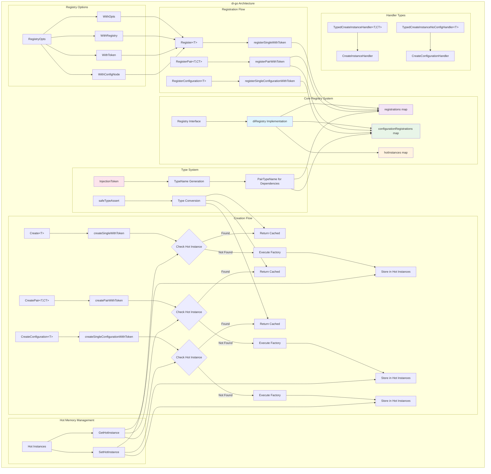

# di-go

A powerful dependency injection library for Go that supports configuration management, JSON templating, and flexible service registration.

## Features

- **Type-safe Dependency Injection**: Leverage Go generics for compile-time type safety
- **Configuration Management**: Built-in support for configuration injection and resolution
- **JSON Templating**: Advanced JSON configuration with variable interpolation and shared sections
- **Singleton Support**: Automatic singleton management for services
- **Flexible Service Registration**: Support for both factory functions and configuration-based registration

## Quick Start

### Basic Service Registration
```go
// Register a service with a factory function 
Register[MyService](func(c Context, opts *RegistryOpts) (MyService, error) { return MyService{}, nil })

// Create an instance 
ctx := NewContext(config) service, err := Create[MyService](ctx)
```

 
### Configuration-Based Services

```go
// Register configuration type 
RegisterConfiguration[RedisConfig](ConfigurationLookup[RedisConfig])

// Create configuration instance 
redisConfig, err := CreateConfiguration[RedisConfig](ctx, WithConfigNode("redis"))
```

### Advanced JSON Configuration

```json
{
  "shared": {
    "database": {
      "host": "localhost",
      "port": 5432
    }
  },
  "services": {
    "user_service": {
      "db": "{di.shared.database}"
    },
    "order_service": {
      "db": "{di.shared.database}"
    }
  }
}
``` 

## Core Concepts

### Context
The `Context` is the central container that holds all registered services and configurations.

### Registration Options
- `WithToken(token)`: Register service with a specific identifier
- `WithConfigNode(node)`: Specify configuration node for service creation
- `WithOpts(opts)`: Pass additional registry options

### Configuration Resolution
The library supports automatic resolution of JSON templates with:
- Shared configuration sections (`$shared`)
- Variable interpolation (`${di.path.to.value}`)
- Nested object references

## API Reference

### Core Functions

- `Register[T](factory, ...opts)`: Register a service factory
- `RegisterConfiguration[T](lookup)`: Register a configuration type
- `Create[T](context, ...opts)`: Create service instance
- `CreateConfiguration[T](context, ...opts)`: Create configuration instance
- `NewContext(config)`: Create new DI context
- `UnmarshalJSONWithDIResolution(data, target)`: Parse JSON with template resolution

### Configuration Interface

```go
type Configuration interface {
    LookupNode(lookupPath string) (any, error)
}
```


## High Level architecture of di.Registry



This README and diagram provide a comprehensive overview of the di-go library's architecture and capabilities. The library appears to be designed for complex enterprise applications where configuration management and dependency injection are critical concerns.

## Examples
See the test files for comprehensive examples including:
- Complex service hierarchies
- Configuration sharing and templating
- Singleton pattern implementation
- Multi-level dependency injection
